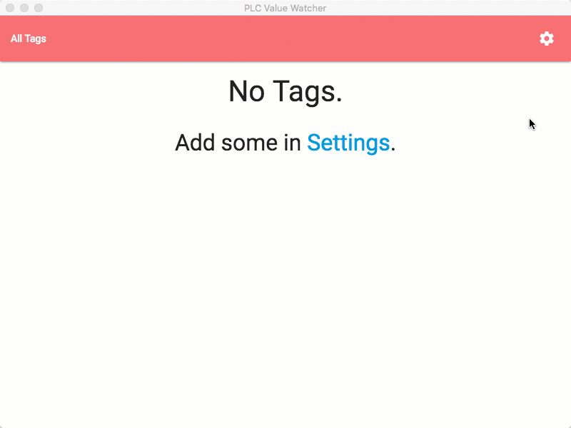

# node-ethernet-ip-electron

A basic electron app to read values from a PLC.
[](https://travis-ci.org/patrickjmcd/node-ethernet-ip-electron)



## Install
``` bash
# Clone the repository
$ git clone https://github.com/patrickjmcd/node-ethernet-ip-electron

# Go into the repository
$ cd node-ethernet-ip-electron

# Install dependencies
$ npm install
```

## Develop
Just run this command to start developing with hot reloading.
``` bash
$ npm start
```
